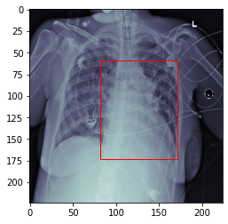

## Model Training
We are ready to train the Cardiac Detection Model now!

## Imports:

* torch and torchvision for model and dataloader creation
* pytorch lightning for efficient and easy training implementation
* ModelCheckpoint and TensorboardLogger for checkpoint saving and logging
* numpy data loading
* cv2 for drawing rectangles on images
* imgaug for augmentation pipeline
* Our CardiacDataset


```python
import torch
import torchvision
import pytorch_lightning as pl
from pytorch_lightning.callbacks import ModelCheckpoint
from pytorch_lightning.loggers import TensorBoardLogger
import numpy as np
import cv2
import imgaug.augmenters as iaa
from dataset import CardiacDataset
```

We create the dataset objects and the augmentation parameters to specify the augmentation parameters


```python
train_root_path = "Processed-Heart-Detection/train/"
train_subjects = "train_subjects.npy"
val_root_path = "Processed-Heart-Detection/val/"
val_subjects = "val_subjects.npy"

train_transforms = iaa.Sequential([
                                iaa.GammaContrast(),
                                iaa.Affine(
                                    scale=(0.8, 1.2),
                                    rotate=(-10, 10),
                                    translate_px=(-10, 10)
                                )
                            ])
```


```python
train_dataset = CardiacDataset("rsna_heart_detection.csv", train_subjects, train_root_path, train_transforms)
val_dataset = CardiacDataset("rsna_heart_detection.csv", val_subjects, val_root_path, None)
```


```python
batch_size = 8
num_workers = 4

train_loader = torch.utils.data.DataLoader(train_dataset, batch_size=batch_size, num_workers=num_workers, shuffle=True)
val_loader = torch.utils.data.DataLoader(val_dataset, batch_size=batch_size, num_workers=num_workers, shuffle=False)
```


```python
train_dataset = CardiacDataset(
    "./rsna_heart_detection.csv",
     train_subjects,
     train_root_path,
     augs = train_transforms)

val_dataset = CardiacDataset(
    "./rsna_heart_detection.csv",
     val_subjects,
     val_root_path,
     augs=None)

print(f"There are {len(train_dataset)} train images and {len(val_dataset)} val images")
```

    There are 400 train images and 96 val images


```python
batch_size = 8#TODO
num_workers = 4# TODO


train_loader = torch.utils.data.DataLoader(train_dataset, batch_size=batch_size,
                                           num_workers=num_workers, shuffle=True)
val_loader = torch.utils.data.DataLoader(val_dataset, batch_size=batch_size, num_workers=num_workers, shuffle=False)

```

We use the same architecture as we used in the classifcation task with some small adaptations:

1. 4 outputs: Instead of predicting a binary label we need to estimate the location of the heart (xmin, ymin, xmax, ymax).
2. Loss function: Instead of using a cross entropy loss, we are going to use the L2 loss (Mean Squared Error), as we are dealing with continuous values.


```python
class CardiacDetectionModel(pl.LightningModule):
    def __init__(self):
        super().__init__()
        
        self.model = torchvision.models.resnet18(pretrained=True)
        self.model.conv1 = torch.nn.Conv2d(1, 64, kernel_size=(7, 7), stride=(2, 2), padding=(3, 3), bias=False)
        self.model.fc = torch.nn.Linear(in_features=512 ,out_features=4)
        
        self.optimizer = torch.optim.Adam(self.model.parameters(), lr=1e-4)
        self.loss_fn = torch.nn.MSELoss()
        
    def forward(self, data):
        return self.model(data)
    
    def training_step(self, batch, batch_idx):
        x_ray, label = batch
        label = label.float()
        pred = self(x_ray)
        loss = self.loss_fn(pred, label)
        
        self.log("Train Loss", loss)
        
        if batch_idx % 50 == 0:
            self.log_images(x_ray.cpu(), pred.cpu(), label.cpu(), "Train")
        return loss
    
    def validation_step(self, batch, batch_idx):
        x_ray, label = batch
        label = label.float()
        pred = self(x_ray)
        loss = self.loss_fn(pred, label)
        
        self.log("Val Loss", loss)
        
        if batch_idx % 50 == 0:
            self.log_images(x_ray.cpu(), pred.cpu(), label.cpu(), "Val")
        return loss
    
    def log_images(self, x_ray, pred, label, name):
        results = []
        
        for i in range(4):
            coords_labels = label[i]
            coords_pred = pred[i]
            
            img = ((x_ray[i] * 0.252)+0.494).numpy()[0]
            
            x0, y0 = coords_labels[0].int().item(), coords_labels[1].int().item()
            x1, y1 = coords_labels[2].int().item(), coords_labels[3].int().item()
            img = cv2.rectangle(img, (x0, y0), (x1, y1), (0, 0, 0), 2)
            
            x0, y0 = coords_pred[0].int().item(), coords_pred[1].int().item()
            x1, y1 = coords_pred[2].int().item(), coords_pred[3].int().item()
            img = cv2.rectangle(img, (x0, y0), (x1, y1), (1, 1, 1), 2)
            
            results.append(torch.tensor(img).unsqueeze(0))
        
        grid = torchvision.utils.make_grid(results, 2)
        self.logger.experiment.add_image(name, grid, self.global_step)
        
    def configure_optimizers(self):
        #Caution! You always need to return a list here (just pack your optimizer into one :))
        return [self.optimizer]

```


```python
class CardiacDetectionModel(pl.LightningModule):
    def __init__(self):
        super().__init__()
        
        self.model = torchvision.models.resnet18(pretrained=True)
        
        # Change conv1 from 3 to 1 input channels
        self.model.conv1 = torch.nn.Conv2d(1, 64, kernel_size=(7, 7), stride=(2, 2), padding=(3, 3), bias=False)
        
        # Change out_feature of the last fully connected layer (called fc in resnet18) from 1000 to 4
        self.model.fc = torch.nn.Linear(in_features=512, out_features=4)
        
        self.optimizer = torch.optim.Adam(self.model.parameters(), lr=1e-4)
        self.loss_fn = torch.nn.MSELoss()
    
    def forward(self, data):
        pred = self.model(data)
        return pred
    
    def training_step(self, batch, batch_idx):
        x_ray, label = batch
        label = label.float()  # Convert label to float (just needed for loss computation)
        pred = self(x_ray)
        loss = self.loss_fn(pred, label)  # Compute the loss
        
        # Log loss
        self.log("Train Loss", loss)
        if batch_idx % 50 == 0:
            self.log_images(x_ray.cpu(), pred.cpu(), label.cpu(), "Train")

        return loss
    
        
    def validation_step(self, batch, batch_idx):
        # Same steps as in the training_step
        x_ray, label = batch
        label = label

        label = label.float()  # Convert label to float (just needed for loss computation)
        pred = self(x_ray)
        
        loss = self.loss_fn(pred, label)
        self.log("Val Loss", loss)
        if batch_idx % 50 == 0:
            self.log_images(x_ray.cpu(), pred.cpu(), label.cpu(), "Val")
        return loss
    
    def log_images(self, x_ray, pred, label, name):
        results = []
        
        # Here we create a grid consisting of 4 predictions
        for i in range(4):
            coords_labels = label[i]
            coords_pred = pred[i]
            img = ((x_ray[i] * 0.252)+0.494).numpy()[0]
            
            # Extract the coordinates from the label
            x0, y0 = coords_labels[0].int().item(), coords_labels[1].int().item()
            x1, y1 = coords_labels[2].int().item(), coords_labels[3].int().item()
            img = cv2.rectangle(img, (x0, y0), (x1, y1), (0, 0, 0), 2)
            
            # Extract the coordinates from the prediction           
            x0, y0 = coords_pred[0].int().item(), coords_pred[1].int().item()
            x1, y1 = coords_pred[2].int().item(), coords_pred[3].int().item()
            img = cv2.rectangle(img, (x0, y0), (x1, y1), (1, 1, 1), 2)
            
            
            results.append(torch.tensor(img).unsqueeze(0))
        grid = torchvision.utils.make_grid(results, 2)
        self.logger.experiment.add_image(f"{name} Prediction vs Label", grid, self.global_step)

            
    
    def configure_optimizers(self):
        #Caution! You always need to return a list here (just pack your optimizer into one :))
        return [self.optimizer]


```


```python
# Create the model object
model = CardiacDetectionModel()  # Instanciate the model
```


```python
# Create the checkpoint callback
checkpoint_callback = ModelCheckpoint(
    monitor='Val Loss',
    save_top_k=10,
    mode='min')
```

Train for at least 50 epochs to get a decent result.
100 epochs lead to great results.

You can train this on a CPU!


```python
# Create the trainer
# Change the gpus parameter to the number of available gpus in your computer. Use 0 for CPU training

gpus = 1 #TODO
trainer = pl.Trainer(gpus=gpus, logger=TensorBoardLogger("./logs"), log_every_n_steps=1,
                     default_root_dir="./weights", callbacks=checkpoint_callback,
                     max_epochs=100)

```

    GPU available: True, used: True
    TPU available: False, using: 0 TPU cores
    IPU available: False, using: 0 IPUs


```python
# Train the detection model
trainer.fit(model, train_loader, val_loader)
```

    LOCAL_RANK: 0 - CUDA_VISIBLE_DEVICES: [0]
    
      | Name    | Type    | Params
    ------------------------------------
    0 | model   | ResNet  | 11.2 M
    1 | loss_fn | MSELoss | 0     
    ------------------------------------
    11.2 M    Trainable params
    0         Non-trainable params
    11.2 M    Total params
    44.689    Total estimated model params size (MB)


    Validation sanity check: 0it [00:00, ?it/s]


    Training: -1it [00:20, ?it/s]


    Validating: 0it [00:00, ?it/s]


    Validating: 0it [00:00, ?it/s]


    Validating: 0it [00:00, ?it/s]


    Validating: 0it [00:00, ?it/s]


    Validating: 0it [00:00, ?it/s]


    Validating: 0it [00:00, ?it/s]


    Validating: 0it [00:00, ?it/s]


    Validating: 0it [00:00, ?it/s]


    Validating: 0it [00:00, ?it/s]


    Validating: 0it [00:00, ?it/s]


    Validating: 0it [00:00, ?it/s]


    Validating: 0it [00:00, ?it/s]


    Validating: 0it [00:00, ?it/s]


    Validating: 0it [00:00, ?it/s]


    Validating: 0it [00:00, ?it/s]


    Validating: 0it [00:00, ?it/s]


    Validating: 0it [00:00, ?it/s]


    Validating: 0it [00:00, ?it/s]


    Validating: 0it [00:00, ?it/s]


    Validating: 0it [00:00, ?it/s]


    Validating: 0it [00:00, ?it/s]


    Validating: 0it [00:00, ?it/s]


    Validating: 0it [00:00, ?it/s]


    Validating: 0it [00:00, ?it/s]


    Validating: 0it [00:00, ?it/s]


    Validating: 0it [00:00, ?it/s]


    Validating: 0it [00:00, ?it/s]


    Validating: 0it [00:00, ?it/s]


    Validating: 0it [00:00, ?it/s]


    Validating: 0it [00:00, ?it/s]


    Validating: 0it [00:00, ?it/s]


    Validating: 0it [00:00, ?it/s]


    Validating: 0it [00:00, ?it/s]


    Validating: 0it [00:00, ?it/s]


    Validating: 0it [00:00, ?it/s]


    Validating: 0it [00:00, ?it/s]


    Validating: 0it [00:00, ?it/s]


    Validating: 0it [00:00, ?it/s]


    Validating: 0it [00:00, ?it/s]


    Validating: 0it [00:00, ?it/s]


    Validating: 0it [00:00, ?it/s]


    Validating: 0it [00:00, ?it/s]


    Validating: 0it [00:00, ?it/s]


    Validating: 0it [00:00, ?it/s]


    Validating: 0it [00:00, ?it/s]


    Validating: 0it [00:00, ?it/s]


    Validating: 0it [00:00, ?it/s]


    Validating: 0it [00:00, ?it/s]


    Validating: 0it [00:00, ?it/s]


    Validating: 0it [00:00, ?it/s]


    Validating: 0it [00:00, ?it/s]


    Validating: 0it [00:00, ?it/s]


    Validating: 0it [00:00, ?it/s]


    Validating: 0it [00:00, ?it/s]


    Validating: 0it [00:00, ?it/s]


    Validating: 0it [00:00, ?it/s]


    Validating: 0it [00:00, ?it/s]


    Validating: 0it [00:00, ?it/s]


    Validating: 0it [00:00, ?it/s]


    Validating: 0it [00:00, ?it/s]


    Validating: 0it [00:00, ?it/s]


    Validating: 0it [00:00, ?it/s]


    Validating: 0it [00:00, ?it/s]


    Validating: 0it [00:00, ?it/s]


    Validating: 0it [00:00, ?it/s]


    Validating: 0it [00:00, ?it/s]


    Validating: 0it [00:00, ?it/s]


    Validating: 0it [00:00, ?it/s]


    Validating: 0it [00:00, ?it/s]


    Validating: 0it [00:00, ?it/s]


    Validating: 0it [00:00, ?it/s]


    Validating: 0it [00:00, ?it/s]


    Validating: 0it [00:00, ?it/s]


    Validating: 0it [00:00, ?it/s]


    Validating: 0it [00:00, ?it/s]


    Validating: 0it [00:00, ?it/s]


    Validating: 0it [00:00, ?it/s]


    Validating: 0it [00:00, ?it/s]


    Validating: 0it [00:00, ?it/s]


    Validating: 0it [00:00, ?it/s]


    Validating: 0it [00:00, ?it/s]


    Validating: 0it [00:00, ?it/s]


    Validating: 0it [00:00, ?it/s]


    Validating: 0it [00:00, ?it/s]


    Validating: 0it [00:00, ?it/s]


    Validating: 0it [00:00, ?it/s]


    Validating: 0it [00:00, ?it/s]


    Validating: 0it [00:00, ?it/s]


    Validating: 0it [00:00, ?it/s]


    Validating: 0it [00:00, ?it/s]


    Validating: 0it [00:00, ?it/s]


    Validating: 0it [00:00, ?it/s]


    Validating: 0it [00:00, ?it/s]


    Validating: 0it [00:00, ?it/s]


    Validating: 0it [00:00, ?it/s]


    Validating: 0it [00:00, ?it/s]


    Exception ignored in: Exception ignored in: <function _MultiProcessingDataLoaderIter.__del__ at 0x7f946cac38b0><function _MultiProcessingDataLoaderIter.__del__ at 0x7f946cac38b0>
    
    Traceback (most recent call last):
      File "/home/george/anaconda3/envs/pytorchenv/lib/python3.8/site-packages/torch/utils/data/dataloader.py", line 1328, in __del__
    Exception ignored in:     self._shutdown_workers()<function _MultiProcessingDataLoaderIter.__del__ at 0x7f946cac38b0>
      File "/home/george/anaconda3/envs/pytorchenv/lib/python3.8/site-packages/torch/utils/data/dataloader.py", line 1320, in _shutdown_workers
    
    Traceback (most recent call last):
          File "/home/george/anaconda3/envs/pytorchenv/lib/python3.8/site-packages/torch/utils/data/dataloader.py", line 1328, in __del__
    if w.is_alive():
      File "/home/george/anaconda3/envs/pytorchenv/lib/python3.8/multiprocessing/process.py", line 160, in is_alive
            assert self._parent_pid == os.getpid(), 'can only test a child process'
    AssertionError: Traceback (most recent call last):
    can only test a child process  File "/home/george/anaconda3/envs/pytorchenv/lib/python3.8/site-packages/torch/utils/data/dataloader.py", line 1328, in __del__
    
        self._shutdown_workers()
      File "/home/george/anaconda3/envs/pytorchenv/lib/python3.8/site-packages/torch/utils/data/dataloader.py", line 1320, in _shutdown_workers
        if w.is_alive():self._shutdown_workers()
    
      File "/home/george/anaconda3/envs/pytorchenv/lib/python3.8/site-packages/torch/utils/data/dataloader.py", line 1320, in _shutdown_workers
      File "/home/george/anaconda3/envs/pytorchenv/lib/python3.8/multiprocessing/process.py", line 160, in is_alive
        assert self._parent_pid == os.getpid(), 'can only test a child process'
    AssertionError: can only test a child process
      File "/home/george/anaconda3/envs/pytorchenv/lib/python3.8/multiprocessing/process.py", line 160, in is_alive
        if w.is_alive():
        Exception ignored in: <function _MultiProcessingDataLoaderIter.__del__ at 0x7f946cac38b0>
    Traceback (most recent call last):
    assert self._parent_pid == os.getpid(), 'can only test a child process'  File "/home/george/anaconda3/envs/pytorchenv/lib/python3.8/site-packages/torch/utils/data/dataloader.py", line 1328, in __del__
    
    AssertionError    : can only test a child processself._shutdown_workers()
    
      File "/home/george/anaconda3/envs/pytorchenv/lib/python3.8/site-packages/torch/utils/data/dataloader.py", line 1320, in _shutdown_workers
        if w.is_alive():
      File "/home/george/anaconda3/envs/pytorchenv/lib/python3.8/multiprocessing/process.py", line 160, in is_alive
        assert self._parent_pid == os.getpid(), 'can only test a child process'
    AssertionError: can only test a child process


    Validating: 0it [00:00, ?it/s]


    Exception ignored in: <function _MultiProcessingDataLoaderIter.__del__ at 0x7f946cac38b0>
    Traceback (most recent call last):
      File "/home/george/anaconda3/envs/pytorchenv/lib/python3.8/site-packages/torch/utils/data/dataloader.py", line 1328, in __del__
        self._shutdown_workers()Exception ignored in: Exception ignored in: <function _MultiProcessingDataLoaderIter.__del__ at 0x7f946cac38b0><function _MultiProcessingDataLoaderIter.__del__ at 0x7f946cac38b0>
    
    Traceback (most recent call last):
    Traceback (most recent call last):
    
      File "/home/george/anaconda3/envs/pytorchenv/lib/python3.8/site-packages/torch/utils/data/dataloader.py", line 1328, in __del__
      File "/home/george/anaconda3/envs/pytorchenv/lib/python3.8/site-packages/torch/utils/data/dataloader.py", line 1320, in _shutdown_workers
        self._shutdown_workers()
          File "/home/george/anaconda3/envs/pytorchenv/lib/python3.8/site-packages/torch/utils/data/dataloader.py", line 1320, in _shutdown_workers
    if w.is_alive():
      File "/home/george/anaconda3/envs/pytorchenv/lib/python3.8/multiprocessing/process.py", line 160, in is_alive
        assert self._parent_pid == os.getpid(), 'can only test a child process'  File "/home/george/anaconda3/envs/pytorchenv/lib/python3.8/site-packages/torch/utils/data/dataloader.py", line 1328, in __del__
    
        AssertionErrorself._shutdown_workers(): 
    can only test a child process  File "/home/george/anaconda3/envs/pytorchenv/lib/python3.8/site-packages/torch/utils/data/dataloader.py", line 1320, in _shutdown_workers
    
        if w.is_alive():
    Exception ignored in:   File "/home/george/anaconda3/envs/pytorchenv/lib/python3.8/multiprocessing/process.py", line 160, in is_alive
    <function _MultiProcessingDataLoaderIter.__del__ at 0x7f946cac38b0>
        Traceback (most recent call last):
      File "/home/george/anaconda3/envs/pytorchenv/lib/python3.8/site-packages/torch/utils/data/dataloader.py", line 1328, in __del__
            self._shutdown_workers()
      File "/home/george/anaconda3/envs/pytorchenv/lib/python3.8/site-packages/torch/utils/data/dataloader.py", line 1320, in _shutdown_workers
        if w.is_alive():if w.is_alive():
    
      File "/home/george/anaconda3/envs/pytorchenv/lib/python3.8/multiprocessing/process.py", line 160, in is_alive
      File "/home/george/anaconda3/envs/pytorchenv/lib/python3.8/multiprocessing/process.py", line 160, in is_alive
        assert self._parent_pid == os.getpid(), 'can only test a child process'
        assert self._parent_pid == os.getpid(), 'can only test a child process'
    AssertionError: AssertionErrorcan only test a child processassert self._parent_pid == os.getpid(), 'can only test a child process'
    : can only test a child process
    
    AssertionError: can only test a child process


    Validating: 0it [00:00, ?it/s]


    Exception ignored in: Exception ignored in: <function _MultiProcessingDataLoaderIter.__del__ at 0x7f946cac38b0><function _MultiProcessingDataLoaderIter.__del__ at 0x7f946cac38b0>
    
    Exception ignored in: Traceback (most recent call last):
    <function _MultiProcessingDataLoaderIter.__del__ at 0x7f946cac38b0>  File "/home/george/anaconda3/envs/pytorchenv/lib/python3.8/site-packages/torch/utils/data/dataloader.py", line 1328, in __del__
    
        Traceback (most recent call last):
    Traceback (most recent call last):
    self._shutdown_workers()  File "/home/george/anaconda3/envs/pytorchenv/lib/python3.8/site-packages/torch/utils/data/dataloader.py", line 1328, in __del__
    
      File "/home/george/anaconda3/envs/pytorchenv/lib/python3.8/site-packages/torch/utils/data/dataloader.py", line 1328, in __del__
      File "/home/george/anaconda3/envs/pytorchenv/lib/python3.8/site-packages/torch/utils/data/dataloader.py", line 1320, in _shutdown_workers
            self._shutdown_workers()    if w.is_alive():self._shutdown_workers()
    
      File "/home/george/anaconda3/envs/pytorchenv/lib/python3.8/site-packages/torch/utils/data/dataloader.py", line 1320, in _shutdown_workers
    
      File "/home/george/anaconda3/envs/pytorchenv/lib/python3.8/multiprocessing/process.py", line 160, in is_alive
      File "/home/george/anaconda3/envs/pytorchenv/lib/python3.8/site-packages/torch/utils/data/dataloader.py", line 1320, in _shutdown_workers
            assert self._parent_pid == os.getpid(), 'can only test a child process'    if w.is_alive():
    if w.is_alive():
    
      File "/home/george/anaconda3/envs/pytorchenv/lib/python3.8/multiprocessing/process.py", line 160, in is_alive
      File "/home/george/anaconda3/envs/pytorchenv/lib/python3.8/multiprocessing/process.py", line 160, in is_alive
        Exception ignored in: AssertionError    assert self._parent_pid == os.getpid(), 'can only test a child process'<function _MultiProcessingDataLoaderIter.__del__ at 0x7f946cac38b0>: assert self._parent_pid == os.getpid(), 'can only test a child process'
    
    AssertionError
    can only test a child process: AssertionErrorTraceback (most recent call last):
    
    :   File "/home/george/anaconda3/envs/pytorchenv/lib/python3.8/site-packages/torch/utils/data/dataloader.py", line 1328, in __del__
    can only test a child process
        self._shutdown_workers()
    can only test a child process  File "/home/george/anaconda3/envs/pytorchenv/lib/python3.8/site-packages/torch/utils/data/dataloader.py", line 1320, in _shutdown_workers
    
        if w.is_alive():
      File "/home/george/anaconda3/envs/pytorchenv/lib/python3.8/multiprocessing/process.py", line 160, in is_alive
        assert self._parent_pid == os.getpid(), 'can only test a child process'
    AssertionError: can only test a child process


    Validating: 0it [00:00, ?it/s]


    Exception ignored in: Exception ignored in: <function _MultiProcessingDataLoaderIter.__del__ at 0x7f946cac38b0><function _MultiProcessingDataLoaderIter.__del__ at 0x7f946cac38b0>
    
    Traceback (most recent call last):
    Traceback (most recent call last):
      File "/home/george/anaconda3/envs/pytorchenv/lib/python3.8/site-packages/torch/utils/data/dataloader.py", line 1328, in __del__
      File "/home/george/anaconda3/envs/pytorchenv/lib/python3.8/site-packages/torch/utils/data/dataloader.py", line 1328, in __del__
            self._shutdown_workers()self._shutdown_workers()
    
      File "/home/george/anaconda3/envs/pytorchenv/lib/python3.8/site-packages/torch/utils/data/dataloader.py", line 1320, in _shutdown_workers
      File "/home/george/anaconda3/envs/pytorchenv/lib/python3.8/site-packages/torch/utils/data/dataloader.py", line 1320, in _shutdown_workers
            if w.is_alive():if w.is_alive():
    
      File "/home/george/anaconda3/envs/pytorchenv/lib/python3.8/multiprocessing/process.py", line 160, in is_alive
      File "/home/george/anaconda3/envs/pytorchenv/lib/python3.8/multiprocessing/process.py", line 160, in is_alive
            assert self._parent_pid == os.getpid(), 'can only test a child process'assert self._parent_pid == os.getpid(), 'can only test a child process'
    AssertionError: 
    can only test a child processAssertionError
    : can only test a child process
    Exception ignored in: Exception ignored in: <function _MultiProcessingDataLoaderIter.__del__ at 0x7f946cac38b0><function _MultiProcessingDataLoaderIter.__del__ at 0x7f946cac38b0>
    
    Traceback (most recent call last):
    Traceback (most recent call last):
      File "/home/george/anaconda3/envs/pytorchenv/lib/python3.8/site-packages/torch/utils/data/dataloader.py", line 1328, in __del__
      File "/home/george/anaconda3/envs/pytorchenv/lib/python3.8/site-packages/torch/utils/data/dataloader.py", line 1328, in __del__
            self._shutdown_workers()self._shutdown_workers()
    
      File "/home/george/anaconda3/envs/pytorchenv/lib/python3.8/site-packages/torch/utils/data/dataloader.py", line 1320, in _shutdown_workers
      File "/home/george/anaconda3/envs/pytorchenv/lib/python3.8/site-packages/torch/utils/data/dataloader.py", line 1320, in _shutdown_workers
            if w.is_alive():if w.is_alive():
    
      File "/home/george/anaconda3/envs/pytorchenv/lib/python3.8/multiprocessing/process.py", line 160, in is_alive
      File "/home/george/anaconda3/envs/pytorchenv/lib/python3.8/multiprocessing/process.py", line 160, in is_alive
            assert self._parent_pid == os.getpid(), 'can only test a child process'assert self._parent_pid == os.getpid(), 'can only test a child process'
    
    AssertionErrorAssertionError: : can only test a child processcan only test a child process
    


    Validating: 0it [00:00, ?it/s]


```python
%load_ext tensorboard

```

    The tensorboard extension is already loaded. To reload it, use:
      %reload_ext tensorboard


```python
%tensorboard --logdir logs
```


<iframe id="tensorboard-frame-730947ba5696ffe7" width="100%" height="800" frameborder="0">
</iframe>
<script>
  (function() {
    const frame = document.getElementById("tensorboard-frame-730947ba5696ffe7");
    const url = new URL("/", window.location);
    const port = 6007;
    if (port) {
      url.port = port;
    }
    frame.src = url;
  })();
</script>


## Evaluation


```python
import matplotlib.pyplot as plt
import matplotlib.patches as patches

```


```python
device = torch.device("cuda:0" if torch.cuda.is_available() else "cpu")
model = model.load_from_checkpoint("logs/default/version_1/checkpoints/epoch=94-step=4749.ckpt")
model.eval();
model.to(device)
```


    CardiacDetectionModel(
      (model): ResNet(
        (conv1): Conv2d(1, 64, kernel_size=(7, 7), stride=(2, 2), padding=(3, 3), bias=False)
        (bn1): BatchNorm2d(64, eps=1e-05, momentum=0.1, affine=True, track_running_stats=True)
        (relu): ReLU(inplace=True)
        (maxpool): MaxPool2d(kernel_size=3, stride=2, padding=1, dilation=1, ceil_mode=False)
        (layer1): Sequential(
          (0): BasicBlock(
            (conv1): Conv2d(64, 64, kernel_size=(3, 3), stride=(1, 1), padding=(1, 1), bias=False)
            (bn1): BatchNorm2d(64, eps=1e-05, momentum=0.1, affine=True, track_running_stats=True)
            (relu): ReLU(inplace=True)
            (conv2): Conv2d(64, 64, kernel_size=(3, 3), stride=(1, 1), padding=(1, 1), bias=False)
            (bn2): BatchNorm2d(64, eps=1e-05, momentum=0.1, affine=True, track_running_stats=True)
          )
          (1): BasicBlock(
            (conv1): Conv2d(64, 64, kernel_size=(3, 3), stride=(1, 1), padding=(1, 1), bias=False)
            (bn1): BatchNorm2d(64, eps=1e-05, momentum=0.1, affine=True, track_running_stats=True)
            (relu): ReLU(inplace=True)
            (conv2): Conv2d(64, 64, kernel_size=(3, 3), stride=(1, 1), padding=(1, 1), bias=False)
            (bn2): BatchNorm2d(64, eps=1e-05, momentum=0.1, affine=True, track_running_stats=True)
          )
        )
        (layer2): Sequential(
          (0): BasicBlock(
            (conv1): Conv2d(64, 128, kernel_size=(3, 3), stride=(2, 2), padding=(1, 1), bias=False)
            (bn1): BatchNorm2d(128, eps=1e-05, momentum=0.1, affine=True, track_running_stats=True)
            (relu): ReLU(inplace=True)
            (conv2): Conv2d(128, 128, kernel_size=(3, 3), stride=(1, 1), padding=(1, 1), bias=False)
            (bn2): BatchNorm2d(128, eps=1e-05, momentum=0.1, affine=True, track_running_stats=True)
            (downsample): Sequential(
              (0): Conv2d(64, 128, kernel_size=(1, 1), stride=(2, 2), bias=False)
              (1): BatchNorm2d(128, eps=1e-05, momentum=0.1, affine=True, track_running_stats=True)
            )
          )
          (1): BasicBlock(
            (conv1): Conv2d(128, 128, kernel_size=(3, 3), stride=(1, 1), padding=(1, 1), bias=False)
            (bn1): BatchNorm2d(128, eps=1e-05, momentum=0.1, affine=True, track_running_stats=True)
            (relu): ReLU(inplace=True)
            (conv2): Conv2d(128, 128, kernel_size=(3, 3), stride=(1, 1), padding=(1, 1), bias=False)
            (bn2): BatchNorm2d(128, eps=1e-05, momentum=0.1, affine=True, track_running_stats=True)
          )
        )
        (layer3): Sequential(
          (0): BasicBlock(
            (conv1): Conv2d(128, 256, kernel_size=(3, 3), stride=(2, 2), padding=(1, 1), bias=False)
            (bn1): BatchNorm2d(256, eps=1e-05, momentum=0.1, affine=True, track_running_stats=True)
            (relu): ReLU(inplace=True)
            (conv2): Conv2d(256, 256, kernel_size=(3, 3), stride=(1, 1), padding=(1, 1), bias=False)
            (bn2): BatchNorm2d(256, eps=1e-05, momentum=0.1, affine=True, track_running_stats=True)
            (downsample): Sequential(
              (0): Conv2d(128, 256, kernel_size=(1, 1), stride=(2, 2), bias=False)
              (1): BatchNorm2d(256, eps=1e-05, momentum=0.1, affine=True, track_running_stats=True)
            )
          )
          (1): BasicBlock(
            (conv1): Conv2d(256, 256, kernel_size=(3, 3), stride=(1, 1), padding=(1, 1), bias=False)
            (bn1): BatchNorm2d(256, eps=1e-05, momentum=0.1, affine=True, track_running_stats=True)
            (relu): ReLU(inplace=True)
            (conv2): Conv2d(256, 256, kernel_size=(3, 3), stride=(1, 1), padding=(1, 1), bias=False)
            (bn2): BatchNorm2d(256, eps=1e-05, momentum=0.1, affine=True, track_running_stats=True)
          )
        )
        (layer4): Sequential(
          (0): BasicBlock(
            (conv1): Conv2d(256, 512, kernel_size=(3, 3), stride=(2, 2), padding=(1, 1), bias=False)
            (bn1): BatchNorm2d(512, eps=1e-05, momentum=0.1, affine=True, track_running_stats=True)
            (relu): ReLU(inplace=True)
            (conv2): Conv2d(512, 512, kernel_size=(3, 3), stride=(1, 1), padding=(1, 1), bias=False)
            (bn2): BatchNorm2d(512, eps=1e-05, momentum=0.1, affine=True, track_running_stats=True)
            (downsample): Sequential(
              (0): Conv2d(256, 512, kernel_size=(1, 1), stride=(2, 2), bias=False)
              (1): BatchNorm2d(512, eps=1e-05, momentum=0.1, affine=True, track_running_stats=True)
            )
          )
          (1): BasicBlock(
            (conv1): Conv2d(512, 512, kernel_size=(3, 3), stride=(1, 1), padding=(1, 1), bias=False)
            (bn1): BatchNorm2d(512, eps=1e-05, momentum=0.1, affine=True, track_running_stats=True)
            (relu): ReLU(inplace=True)
            (conv2): Conv2d(512, 512, kernel_size=(3, 3), stride=(1, 1), padding=(1, 1), bias=False)
            (bn2): BatchNorm2d(512, eps=1e-05, momentum=0.1, affine=True, track_running_stats=True)
          )
        )
        (avgpool): AdaptiveAvgPool2d(output_size=(1, 1))
        (fc): Linear(in_features=512, out_features=4, bias=True)
      )
      (loss_fn): MSELoss()
    )


Compute prediction for all validation samples


```python
preds = []
labels = []

with torch.no_grad():
    for data, label in val_dataset:
        data = data.to(device).float().unsqueeze(0)
        pred = model(data)[0].cpu()
        preds.append(pred)
        labels.append(label)
        
preds=torch.stack(preds)
labels=torch.stack(labels)
```

Compute mean deviation between prediction and labels for each coordinate


```python
abs(preds-labels).mean(0)
```


    tensor([3.7014, 5.2912, 6.1015, 5.2156])


Example prediction:


```python
IDX = 40  # Feel free to inspect all validation samples by changing the index
img, label = val_dataset[IDX]
current_pred = preds[IDX]

fig, axis = plt.subplots(1, 1)
axis.imshow(img[0], cmap="bone")
heart = patches.Rectangle((current_pred[0], current_pred[1]), current_pred[2]-current_pred[0],
                          current_pred[3]-current_pred[1], linewidth=1, edgecolor='r', facecolor='none')
axis.add_patch(heart)

print(label)
```

    tensor([ 83,  62, 166, 166])


    

    


```python

```
